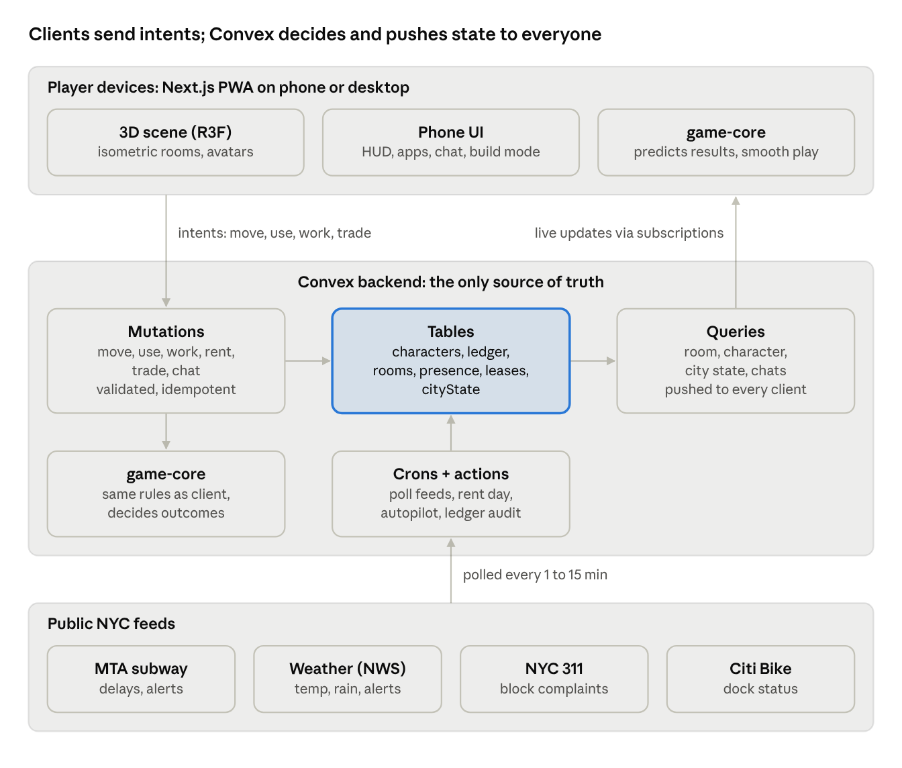
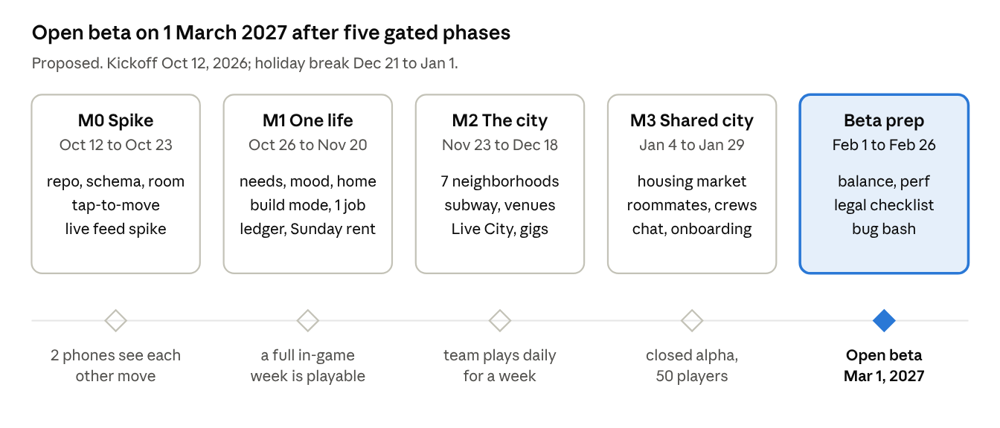

# New York Life — Product Requirements Document

Oct 7, 2026 · Caleb · Live, editable version: https://claude.ai/artifact/CGYxhJBf1tTFL7UNXVnxYw

New York Life is a browser-based, multiplayer life sim set in a New York that reacts to the real city in real time, played as a newcomer trying to make it. Brooklyn ships first; everything below is scoped for a small team building in parallel.

## 1. Overview

**One-liner:** You just landed in New York with two suitcases and $2,400. The city is real, live and shared with every other player. Make it.

**What it is.** A Sims-style life sim in the browser, mobile-first. You manage needs, work, rent, friends and money in an isometric 3D Brooklyn. Every other player lives in the same city at the same time, and they are your roommates, landlords, customers, rivals and friends.

**Reference point.** Lagos Life (lagoslife.app) proves the format: hyper-local culture, satire people recognize, and a player-run economy. We studied its mechanics. We do not reuse its code, art or text.

**What sets us apart (the four hooks):**

1. **Live City.** The world pulls from real NYC feeds. If the L train is delayed in real life, it is delayed in the game. Real snow, real heat advisories, real 311 complaints on your block.
2. **Just Landed.** Everyone starts as a newcomer from somewhere: Lagos, Santo Domingo, Dhaka, Ohio. Origin and immigration status shape what you can do. No life sim tells this story.
3. **The Apartment is the villain.** Broker fees, the 40x-rent rule, housing lotteries, roommates who are real players. Progress is visible: basement, walk-up, doorman, penthouse.
4. **The Hustle stack.** Delivery gigs, vendor permits, sneaker flips, bodega ownership. The side hustle is the main game.

**Why now.** Lagos Life showed that a city-specific, browser-based life sim can spread through a diaspora community. New York has roughly 3 million foreign-born residents (approximate, about 37% of the city), and its live transit, weather and 311 data are public and free. Nobody has built a game on top of them.

## 2. Goals, non-goals and success metrics

The launch goal is a Brooklyn beta where 1,000 players log in weekly and 30% of them interact with another player's property, business or crew.

**Goals**

- Ship a multiplayer life sim that feels like New York in the first 60 seconds.
- Make other players necessary: housing, jobs and businesses all work better with real people.
- Make the live city visible every session, so no two days play the same.
- Run well on a mid-range Android phone over 4G.

**Non-goals for v1**

- Other boroughs, other US cities, flights between cities.
- Elections, crime and courts (planned for v2, see Roadmap).
- Real-money crypto, NFTs or cash-out of any in-game currency.
- Native iOS/Android apps. We ship a PWA.
- Voice chat.

**Success metrics (beta, first 8 weeks)**

| Metric | Target | Why it matters |
| --- | --- | --- |
| Day-1 retention | 40% | First session lands |
| Day-7 retention | 20% | Core loop holds |
| Weekly active players | 1,000 | Enough density for a live economy |
| Sessions per active player per day | 2.5 | Live City pulls people back |
| Players in a player-to-player deal per week | 30% of WAU | Multiplayer is load-bearing |
| Screenshots/shares per 100 WAU per week | 15 | Organic growth |
| p75 time-to-interactive on 4G | under 6 s | Mobile reach |
| Crash-free sessions | 99% | Baseline quality |

## 3. Target players and personas

The core audience is 18–34, phone-first, and either lives in New York, wants to, or has family there. The diaspora angle is the wedge; NYC culture fans are the broad base.

| Persona | Who | What they want | What hooks them |
| --- | --- | --- | --- |
| The Dreamer | 22, Lagos, thinking about japa | Rehearse the move, see what NYC really costs | Just Landed origins, rent math, remittances |
| The New Yorker | 27, Bushwick, works in tech | Laugh at their own city | L train delays, broker fees, bodega cat, 311 satire |
| The Diaspora Kid | 19, Bronx, Ghanaian parents | Play a story that looks like their family | Origins, family calls, food and community venues |
| The Grinder | 24, anywhere, plays BitLife and idle games | Numbers going up | Hustle stack, businesses, net-worth rank |
| The Social | 21, anywhere | Hang out with friends in a shared space | Crews, roommates, parties, chat |

Primary markets for beta: US (NYC metro first), Nigeria, Ghana, UK, Caribbean. English only at launch.

## 4. Product pillars

Every feature must serve at least one pillar. If it serves none, it waits.

| Pillar | Player feeling | Design rule | Test question |
| --- | --- | --- | --- |
| Live City | "The game knows what's happening outside my window" | At least one live signal is visible on every screen that shows the city | Would this play differently today than yesterday? |
| Just Landed | "This is my story, or my cousin's" | Origin and status change real options, never just a flag on a profile | Would a newcomer from Lagos and one from Ohio play this differently? |
| The Apartment | "Rent is the boss fight" | Housing is the main money sink and the main status symbol | Does this connect to where you live or how you pay for it? |
| The Hustle | "I'm one flip away from making it" | Every player can earn from other players | Can a player make money from another player here? |
| Shared City | "Real people live here with me" | Systems are better with people than alone, but never blocked without them | Does this get better when a friend is online? |

**Tone.** Affectionate satire, never mean. We laugh with New Yorkers and newcomers, never at an origin, accent or immigration status. Humor targets systems (landlords, MTA, brokers, bureaucracy), not people.

## 5. Core loop, needs and the game clock

The loop is: keep your needs up, earn money, pay rent on Sunday, spend what's left on status and people. Repeat weekly, climbing housing tiers.

**Moment to moment (seconds):** tap to walk, tap objects to use them, tap people to talk. Actions queue (max 4) and run with an animation and a progress ring.

**Session (10–20 minutes):** commute, work a shift or a gig, eat, see friends, check the city feed.

**Week (real week):** rent is due Sunday 8 PM NYC time. Bills, gig ratings and crew rankings reset. Weekly events run.

**Long arc (months):** move up housing tiers, get promoted, change status (for example student to work visa to green card), own a business, buy property.

### The clock (decision)

- **World time = real New York time** (America/New\_York). Day, night, venue hours, subway service and weather match the real city. This is what makes Live City work and keeps every player in the same moment.
- **Actions are compressed.** A work shift takes 20 real minutes and counts as an 8-hour shift. Sleep takes 10 real minutes online, or happens automatically while offline.
- **Offline is autopilot, not punishment.** While you're away, your character sleeps, eats basic food at home and goes to scheduled shifts at reduced pay. Needs can drop to Low but never to zero while offline.
- **Night players are not locked out.** Overnight shifts, late venues and 24-hour bodegas exist, so a player in Lagos (5–6 hours ahead) still has things to do.

### Needs

Six needs, 0–100. Mood is computed from needs plus active moodlets.

| Need | Drops by (per real hour online) | Main fixes | NYC twist |
| --- | --- | --- | --- |
| Hunger | 25 | Cook, bodega, food cart, delivery | $1 pizza slice is the cheapest fix; delivery costs more and takes real time |
| Energy | 15 | Sleep, coffee, nap on the subway (risky) | Radiator clanking or neighbor noise lowers sleep quality |
| Hygiene | 12 | Shower, laundromat for clothes | No in-unit laundry until the doorman tier |
| Bladder | 30 | Toilet | Public restrooms are rare; cafes say "customers only" |
| Fun | 10 | TV, parks, bars, games, events | Free events in the real city calendar give big fun |
| Social | 8 | Talk, hang out, call home | Calling family back home fixes Social and costs phone credit |

**Mood bands:** Thriving (80+), Good (60–79), Fine (40–59), Stressed (20–39), Burnt out (under 20). Work pay and skill gain scale with mood: +20% at Thriving, −30% at Burnt out.

**Moodlets** are temporary modifiers with a cause and a timer, for example "Train was 22 min late −10 for 2h", "Bodega cat sat on you +8 for 1h", "Heat's out −15 until fixed".

## 6. Systems spec

Each system below is a self-contained workstream with its own data, server functions and UI. Numbers are starting values for tuning, not final balance.

### 6.1 Character creation

Creation takes under 90 seconds and ends at JFK arrivals.

- **Look:** body type, skin tone (12), hair (12 styles incl. braids, locs, fade, afro, waves, hijab), face presets, starter outfit.
- **Name and handle:** display name plus unique `@handle`.
- **Origin** (sets culture, starting network and one perk) and **Status** (sets work rules). Both are chosen, never randomly assigned.
- **Trait:** pick 1 of 8 (Early Bird, Night Owl, Hustler, Charmer, Neat Freak, Foodie, Homebody, Tough Skin). Each changes a need rate or skill rate by 15–25%.

### 6.2 Origins (launch set)

| Origin | Starting perk | Community anchor in Brooklyn | Calls home about |
| --- | --- | --- | --- |
| Lagos, Nigeria | +20% Hustle skill gain | Nigerian church and jollof spot in Flatbush | Japa updates, owambe photos, "when are you visiting?" |
| Accra, Ghana | +15% Social from group hangs | Ghanaian shop in Crown Heights | Family business, funerals and weddings |
| Kingston, Jamaica | +20% Cooking skill gain | Patty shop and sound system on Flatbush Ave | Remittances, church, cricket |
| Santo Domingo, DR | +15% Fun from music and dancing | Bodega and barbershop in Bushwick | Baseball, family visits |
| Dhaka, Bangladesh | +20% Coding skill gain | Grocery and mosque in Kensington | Exams, marriage proposals |
| Small-town Ohio, USA | Starts with $1,000 extra cash, no anchor | None: must build a network from zero | Parents asking if it's safe |

More origins ship as content drops (Port-au-Prince, Mexico City, Lahore, Seoul, Kyiv). Each origin has 1 venue, 3 NPCs, 1 dish and 1 short story arc. Copy for each origin is reviewed by at least one person from that place before release.

### 6.3 Status (immigration and residency)

Status is a rules layer, not a punishment. It changes which jobs you can take and what you have to manage. It never triggers raids, detention or deportation scenes.

| Status | Starting cash | Work rules | Ongoing task | Path forward |
| --- | --- | --- | --- | --- |
| Student visa | $2,400 | Campus jobs only, max 4 shifts a week | Pay tuition every 4 weeks, keep attendance up | Graduate (8 real weeks) to unlock 1 year of open work, then a work visa |
| Work visa | $3,500 | Must hold a job with a sponsoring employer | Keep performance above "Meets"; if fired, 7 real days to find a new sponsor or return to Student | Employer files green card after 6 weeks of good performance |
| Green card (lottery winner) | $1,800 | Any job, any gig | None, but no network or sponsor | Citizenship milestone after 12 weeks |
| US citizen (moving from another state) | $3,400 | Any job, any gig | None | Already there |

If you run out of options on a work visa, you go back to Student status. You never get removed from the game.

### 6.4 Careers and gigs

Careers are scheduled shifts with a 5-level ladder. Gigs are on-demand jobs you start any time, paid per task.

**Careers (launch set)**

| Career | Level 1 → Level 5 | Pay per shift (L1 → L5) | Skill that drives promotion | Open to students? |
| --- | --- | --- | --- | --- |
| Food | Dishwasher → Head Chef | $110 → $520 | Cooking | Yes (campus dining) |
| Retail | Bodega Clerk → Store Owner track | $100 → $450 | Charisma | Yes (campus store) |
| Tech | Help Desk → Staff Engineer | $160 → $1,100 | Coding | Yes (campus IT) |
| Health | Home Aide → Charge Nurse | $140 → $700 | Fitness + Charisma | No |
| Creative | Barista-artist → Gallery headliner | $90 → $900 (volatile) | Creativity | Yes (campus radio) |

Promotion needs: skill level, shift performance average, and days in role. Performance comes from mood, being on time (real subway delays can make you late, but a delay notice from the MTA feed excuses you once a shift) and a 1-tap mini-task during the shift.

**Gigs (not open on Student status)**

| Gig | App (parody name) | Pay | Needs | Risk |
| --- | --- | --- | --- | --- |
| Food delivery | DashDash | $8–18 per drop + tips | Bike or e-bike | Rain doubles tips and slows you; bike theft |
| Dog walking | Wagr | $20 per walk | Fitness 2 | Dog runs off |
| Handy tasks | TaskBunny | $35–90 per task | Fitness or Creativity | Bad rating |
| Street vending | Permit from a player or the city waitlist | Margin on items sold | A cart and a permit | Weather, inspections |
| Sneaker flips | Drops in the city feed | Buy low, sell to players | Cash | Fakes |

### 6.5 Housing

Housing is the main sink and the main status ladder. Rent is weekly and auto-debits Sunday 8 PM.

| Tier | Example | Rent per week | Requirements | Unlocks |
| --- | --- | --- | --- | --- |
| 1. Shared basement room | Crown Heights | $180 | None | Bed, shared bathroom |
| 2. Room in a walk-up share | Bushwick | $300 | 1 week of rent upfront | Your own room, roommates |
| 3. Studio walk-up | Bed-Stuy | $480 | Pass the 40x rule or pay a guarantor fee | Full decorating, hosting up to 4 |
| 4. 1BR elevator building | Prospect Heights | $750 | 40x rule, 2 weeks deposit | In-unit laundry, hosting up to 8 |
| 5. Doorman 1BR | Williamsburg waterfront | $1,150 | 40x rule, credit score 680+ | Doorman, gym, rooftop parties |
| 6. Penthouse | DUMBO | $3,000 | Net worth $250k | Skyline view, hosting up to 30 |

**Mechanics**

- **The 40x rule:** weekly income × 52 must be at least 40× the monthly rent. Otherwise pay a guarantor service 1 week's rent, or co-sign with a roommate.
- **Credit score:** starts at none (new arrival). Built by paying rent and bills on time. Gates tier 5 and loans. This is a real newcomer pain point and a strong progression hook.
- **The hunt:** listings refresh daily. Good listings get many applicants; the landlord picks by score (income, credit, references from other players). "Fees" appear and disappear as satire.
- **Housing lottery:** each week, players can enter a draw for a below-market unit in their income band. 3 winners a week at beta size.
- **Roommates are players.** A lease can hold 2–4 players who split rent automatically. Shared fridge, chore wheel, and a "who ate my food" log.
- **Player landlords.** Players with enough net worth can buy units and list them for rent. Stabilized units cap rent increases at 3% a month. The city takes a 5% fee on every rent payment.
- **Missed rent:** 1 missed week = late fee + warning. 2 missed weeks = eviction to tier 1 and a credit hit. Furniture goes to storage, not lost.
- **Building events:** heat outage in cold real weather, a broken elevator, a super who fixes things "tomorrow".

### 6.6 Economy, money and remittances

One soft currency: in-game dollars ($). It can never be bought for real money and never cashed out. All money moves through server functions with a ledger entry.

**Faucets:** shift pay, gig pay, business income, rent from tenants, lottery and event prizes.

**Sinks:** rent, food, transit fares, furniture, clothes, fees (guarantor, late, permits), tuition, remittances, the 5% city fee on player-to-player trades.

**Target balance:** a player who works 1 shift a day and does 3 gigs can afford tier 2 housing in week 1, tier 3 by week 3, tier 4 by week 6. A player who skips work for a week falls one tier.

**Bank and credit:** checking account (opened in the first-week quest), credit score 300–850, a starter secured card, and small loans from a community lender (the newcomer's only option until credit exists).

**Remittances (signature system).** Players can send money home from the phone. Sending builds a **Family** meter with 5 levels. Each level unlocks rewards: care packages that arrive at your door (your origin's food, +Hunger and +Mood for days), a video call that fully restores Social, family references that raise your housing application score, and a story beat in your origin arc. Not sending for 3 weeks triggers a guilt-trip call, never a penalty. This turns the most common newcomer expense into the emotional core of the game.

**Net-worth board:** a weekly "Brooklyn 100" ranking with a separate "Newcomers" board for players in their first 4 weeks.

### 6.7 Transit

Getting around is a real cost in time and money, and the main place Live City shows up.

| Mode | Cost | Speed | Live City link |
| --- | --- | --- | --- |
| Walk | Free | Slow; 1 neighborhood | Weather: rain lowers Hygiene, snow slows you |
| Bike share (CityCycle parody) | $4.50 per ride | Medium | Real dock availability: an empty dock means walk |
| Subway | Same as the real fare | Fast across Brooklyn | Real delays and suspensions per line |
| Bus | Same as the real fare | Slow, cheap | Traffic events |
| Cab or rideshare | $18–45 | Fast, door to door | Surge pricing in rain and after events |

**Subway in v1:** Brooklyn stations on the L, G, A/C, J/M/Z, 2/3, Q, F and R lines. Riding plays a 10–30 second scene inside the car (showtime dancers, a mariachi trio, someone eating something loud, a seat-taking contest). If a line is delayed in the real MTA feed, the game adds the delay in compressed time and offers alternatives.

### 6.8 Social

**Relationship ladder:** Stranger → Acquaintance (20) → Friend (40) → Close (70) → Day One (90). Points come from talking, hanging out, eating together, gifts, helping with a move or a shift.

**Interactions:** Chat, Joke, Compliment the fit, Talk about home, Vent about rent, Ask for a reference, Invite to hang, Gift, Ask out. Each has a success chance from Charisma, mood and relationship.

**Dating:** Crush → Dating → Partner. Partners can share a lease. One partner at a time in v1.

**Crews:** groups of up to 8 players with a name, colors, a crew chat and a weekly crew goal (for example "together earn $10k" or "attend 3 events"). Crews are the main retention driver.

**Chat:** speech bubbles to players in the same venue, DMs between friends, crew chat. Text only. All chat runs through moderation (section 11).

**NPCs:** every venue has 2–5 NPCs with names and one-line personalities so the city never feels empty when player density is low.

### 6.9 Live City feeds

The server polls public feeds, normalizes them into a **city state** document, and every client subscribes to it. Feed details and access terms must be verified in the M0 spike.

| Source | Poll | What we read | In-game effect |
| --- | --- | --- | --- |
| MTA subway real-time feeds (GTFS-RT) and service alerts | 60 s | Delays, suspensions, planned work per line | Commute delays, "Train late" moodlet, excused lateness, rerouting |
| National Weather Service (api.weather.gov) | 10 min | Temperature, rain, snow, alerts for Brooklyn | Need rates, tips, heat outages, snow days that close venues |
| NYC 311 service requests (NYC Open Data) | 15 min | Complaint types per Brooklyn zip code | Block events: noise complaint, rat sighting, heat or hot water out, illegal parking |
| Citi Bike station status (public GBFS) | 2 min | Bikes and docks per station | Bike share availability |
| Sunrise and sunset | Daily | Computed, no API | Lighting and venue hours |
| NYC events (parks, permitted street events) | Daily | Events with location and time | Free in-game events at the matching venue |

Rules:

- Every live effect has a cap so real-world chaos can never wreck a player (for example, delays add at most 30% to a commute).
- If a feed is down, the game uses the last good value for 1 hour, then a seeded simulated value. The game must be fully playable with every feed off.
- A "Today in Brooklyn" card on the phone explains what's live and why ("The L is delayed right now in real life").

### 6.10 Skills

Six skills, levels 1–10: Cooking, Charisma, Fitness, Coding, Creativity, Hustle (negotiation, flips, prices). Trained by objects (stove, mirror, laptop, guitar, weights), by working and by classes at venues (community college, gym, open mic). Level ups give a small mood boost and unlock interactions, jobs and recipes.

### 6.11 Events, quests and story

**First week (onboarding arc, about 20 minutes total):** land at JFK → get a phone plan → ride the subway to your cousin's or a hostel → open a bank account ("no credit history? interesting") → find a room → first shift or first gig → first rent. Each step teaches one system.

**Daily:** 3 small tasks (for example "Eat a bacon egg and cheese", "Help a player move", "Ride a delayed train without losing your mind") for cash and XP.

**Weekly city events:** rent day, a block party, a sneaker drop, a weekend market, real holidays (West Indian Day Parade on Labor Day, Diwali, Christmas lights in Dyker Heights).

**Origin arcs:** 5 chapters per origin, unlocked by Family level. Written with people from that community.

## 7. Multiplayer design

The server is the only source of truth for money, ownership, needs and time. Clients send intents and draw what the server says.

### 7.1 One city, many rooms

- **City layer (global):** everyone shares one economy, one housing market, one city state, one leaderboard and one chat/DM system.
- **Places (rooms):** every venue, street block and home is a room. You see and talk to players in the same room.
- **Instances:** a public venue holds up to 30 players. Above that, a new instance opens. Friends and crew members are placed in the same instance first.
- **Homes** are private by default. Owners set them to Closed, Friends, Crew or Open house. Roommates always have access.

### 7.2 Movement and presence

This is a tap-to-move life sim, not an action game, so we sync **intents, not positions**.

- A move sends `{room, targetTile, startedAt}`. Every client pathfinds the same route on the same tile grid and animates it.
- Object use sends `{objectId, action}`. The server reserves the object (one user per seat, stove, shower) and returns the start time and duration.
- Presence (who's in the room, idle or away) refreshes every 15 seconds.
- Expected traffic: about 1 write every 3–5 seconds per active player. This fits a reactive database without a separate game server.

### 7.3 Player-to-player economy

| Interaction | How it works | Safeguard |
| --- | --- | --- |
| Renting from a player | Listing → application → owner accepts → weekly auto-debit | Escrowed deposit; rent caps on stabilized units |
| Roommates | Shared lease, rent split by room size | Leaving gives 1 week notice; no surprise debt |
| Hiring players | Business owners post shifts; players take them | Pay held in escrow until the shift ends |
| Selling items | Marketplace listings and face-to-face trade | Both sides confirm; 5% city fee; price bounds per item |
| Sending money | To friends (Friend level and up) | Daily cap $2,000; new accounts capped lower for 7 days |
| Street vending | Players buy from your cart in the same room | Server-side inventory and price |

### 7.4 Authority and anti-cheat

- Every money change is a server mutation writing a ledger row with a reason code. Balances are derived and checked against the ledger nightly.
- Mutations are idempotent (client sends a request id) so retries on a bad connection never double-pay.
- Action durations and cooldowns are enforced server-side from server time. A client cannot speed up a shift.
- Rate limits per player per mutation type. Alt-account farming is limited by phone or email verification, new-account transfer caps and a cluster check on money flows.
- Admin tools: freeze account, reverse a ledger entry, view a player's last 500 actions.

### 7.5 Low player density

The game must feel alive with 50 players online. NPCs fill venues, the city feed shows what other players did recently ("@kemi just moved into a Williamsburg doorman"), and every system works solo.

## 8. World: Brooklyn launch map

Beta ships 7 neighborhoods on a stylized, compressed Brooklyn map, plus JFK as the arrival scene. Each neighborhood is a tile-grid street block with 3–5 enterable venues and a subway entrance.

| Neighborhood | Vibe | Housing tiers | Key venues |
| --- | --- | --- | --- |
| Bushwick | Murals, warehouses, artists | 1–3 | Warehouse party space, bodega with cat, barbershop, mural wall (paintable) |
| Bed-Stuy | Brownstones, stoops, block parties | 2–4 | Stoop hangout, soul food spot, laundromat, community garden |
| Crown Heights | Caribbean and West African community | 1–3 | Patty shop, Ghanaian shop, church hall, Eastern Parkway |
| Flatbush | Busy avenues, Nigerian and Caribbean food | 1–3 | Jollof spot, sound system bar, hair braiding salon, 99-cent store |
| Williamsburg | Waterfront towers, cafes | 4–5 | Overpriced cafe, rooftop bar, record store, waterfront park |
| DUMBO | Bridges, cobblestones, money | 5–6 | Penthouse tower, gallery, pizza line, bridge photo spot |
| Prospect Park | The city's backyard | n/a | Lawn, BBQ area, drum circle, running loop, open-air market on weekends |

**Commercial venues** use parody names, not real businesses. Public landmarks (bridges, parks, avenues, subway lines) use real names.

**Venue hours follow real NYC time.** The bodega is 24/7. Bars open 5 PM–4 AM. The market is Saturday and Sunday mornings. The park closes 1 AM–5 AM.

**Business slots:** 12 storefronts across the map can be bought and run by players in v1.1 (bodega, food cart, barbershop, laundromat, cafe, small bar).

## 9. UX, screens, art direction and audio

The screen is the world first; every menu lives inside an in-game phone.

### 9.1 Main HUD (portrait phone)

- **Top bar:** clock (real NYC time), weather icon and temperature, cash, a "Live" dot that opens Today in Brooklyn.
- **Bottom left:** your avatar portrait with a mood ring; tap for the needs panel.
- **Bottom right:** Phone button.
- **Action queue:** up to 4 icons above the bottom bar, tap to cancel.
- **Toasts:** short events ("The G is suspended. Classic.") at the top, never blocking.

### 9.2 Phone apps

| App | Purpose |
| --- | --- |
| Map | Neighborhoods, venues, subway lines with live status, friends' locations (if shared) |
| Jobs | Career applications and shift schedule |
| Gigs | DashDash, Wagr, TaskBunny |
| Homes | Listings, applications, your lease, roommates, the lottery |
| Bank | Balance, ledger, credit score, loans, send money, send home |
| Chats | DMs and crew chat |
| People | Friends, relationship levels, crew |
| Shop | Furniture, clothes, groceries, delivery |
| Today | Live City card: transit, weather, 311 on your block, events |
| Settings | Account, notifications, privacy, report and block |

### 9.3 Key screens to design first

1. JFK arrival and character creation
2. Street view with HUD
3. Home interior with build mode (place, rotate, sell furniture)
4. Phone home screen and the Homes app
5. Subway ride scene
6. Interaction wheel (tap a person or object)
7. Rent day summary

### 9.4 Art direction

- **Look:** isometric low-poly 3D with flat colors and soft lighting. Readable on a 6-inch screen.
- **City palette:** brownstone red, subway tile white, MTA line colors as accents, sodium-orange streetlights at night.
- **Characters:** stylized, not realistic. Wide range of skin tones and hair types done well, especially Black hair styles. This is a known gap in other games and a reason people will share screenshots.
- **Live weather is visible:** rain, snow and heat haze render in the world, not just as an icon.
- **Assets:** a modular kit (walls, floors, windows, stoops, storefronts) so we can build venues fast. Start from CC0 low-poly packs, replace with custom art over time.

### 9.5 Audio

- Ambient city loops per neighborhood (traffic, kids, a distant siren, birds in the park).
- Subway sounds: doors chime, "stand clear of the closing doors" style announcement (our own recording).
- Licensed or original music per venue: drill and hip hop, Afrobeats, dancehall, bachata, lo-fi in cafes.
- Haptics on mobile for rent day, level ups and money received.

## 10. Technical architecture

We use one TypeScript codebase: a Next.js PWA with a Three.js renderer on a Convex backend, with game rules in a shared package that runs on both sides.



Clients never change money or state directly: they send intents, Convex runs the shared game-core rules, writes the tables and pushes the result to every subscribed client.

### 10.1 Stack

| Layer | Choice | Why |
| --- | --- | --- |
| App shell | Next.js (App Router), TypeScript strict, Tailwind | Team already knows it; PWA install on Android and iOS |
| 3D | React Three Fiber + drei, orthographic isometric camera, instanced meshes | Proven for this genre in the browser; good mobile performance |
| Client state | Zustand for local UI and animation state | Small and simple |
| Backend | Convex: database, queries, mutations, scheduled functions, crons, file storage | Real-time subscriptions out of the box; transactions for money; no game server to run |
| Auth | Convex Auth: email code + Google | Low friction, one verified contact per account |
| Live feeds | Convex actions on crons, writing a single `cityState` document | All clients subscribe to one small document |
| Hosting | Vercel (web) + Convex Cloud | Zero ops for a small team |
| Monitoring | Sentry (errors), PostHog (product analytics) | Free tiers cover beta |

### 10.2 Repo layout (npm workspaces)

```
new-york-life/
├── apps/web/            Next.js app: routes, UI, phone apps, R3F scene
├── packages/game-core/  Pure TS rules: needs decay, mood, pathfinding, pay, rent, balance constants
├── packages/content/    Data: origins, jobs, items, venues, dialogue lines, map tiles
├── convex/              Schema, queries, mutations, crons, feed pollers
└── tools/               Map editor scripts, balance simulator, seed data
```

`game-core` has no I/O and is unit tested. The server calls it to decide outcomes; the client calls it to predict them for smooth animation. Content lives in typed data files so designers and writers can add jobs, items and lines without touching logic.

### 10.3 Core data model

| Table | Key fields | Notes |
| --- | --- | --- |
| users | authId, handle, createdAt, flags | One per account |
| characters | userId, look, origin, status, trait, needs, skills, cash, credit, roomId, homeId | Needs stored with lastUpdatedAt and computed on read |
| ledger | characterId, delta, balanceAfter, reason, refId, requestId | Append-only; requestId unique for idempotency |
| rooms | kind (venue, street, home), neighborhood, instanceOf, capacity | Venue instances created on demand |
| presence | characterId, roomId, tile, intent, updatedAt | One row per online character |
| objects | roomId, type, tile, rotation, ownerId, reservedBy, reservedUntil | Furniture and usable objects |
| units | building, tier, neighborhood, ownerId (player or city), rentPerWeek, stabilized | Housing stock |
| listings, applications, leases | unitId, tenants\[\], rentSplit, startsAt, nextDueAt | Lease cron runs Sunday 8 PM ET |
| jobs, shifts, gigs | career, level, schedule, pay, performance | Shift outcomes computed server-side |
| relationships | a, b, points, level, romance | Stored once per pair |
| crews, crewMembers | name, colors, goal, progress | Max 8 members |
| messages | channel (room, dm, crew), from, body, moderation | Retention 30 days |
| cityState | subway, weather, blockEvents, events, updatedAt, source health | One document |
| reports, sanctions | reporter, target, reason, action | Moderation |

### 10.4 Server functions (first set)

- `character.create`, `character.get`
- `world.enterRoom`, `world.move`, `world.useObject`, `world.cancelAction`
- `work.applyJob`, `work.startShift`, `work.completeShift`, `gig.start`, `gig.complete`
- `homes.search`, `homes.apply`, `homes.accept`, `homes.signLease`, `homes.leave`, `homes.enterLottery`
- `bank.send`, `bank.sendHome`, `bank.loan`
- `social.interact`, `social.inviteCrew`, `chat.send`, `moderation.report`, `moderation.block`
- Crons: `feeds.pollSubway` (60 s), `feeds.pollWeather` (10 min), `feeds.poll311` (15 min), `feeds.pollBikes` (2 min), `rent.collect` (Sun 20:00 ET), `autopilot.tick` (5 min), `ledger.audit` (nightly)

### 10.5 Performance budgets

- First load under 2.5 MB JS + assets before the first frame; streamed after.
- 60 fps on mid-range phones in rooms with up to 30 avatars (instanced bodies, shared materials, baked lighting).
- Under 150 ms from tap to visible response (client prediction, server confirms).

## 11. Monetization, safety and legal

The game is free; real money buys looks and convenience, never in-game dollars, housing or status.

### 11.1 Monetization (after beta stabilizes)

| Stream | What | Rule |
| --- | --- | --- |
| Cosmetics | Outfits, hairstyles, furniture sets, crew colors | Never affects stats |
| Brooklyn Pass (seasonal) | 8-week track of cosmetic rewards from daily play | Free track always exists |
| Supporter tier | Monthly: name color, extra outfit slots, early access to new neighborhoods | No money or stat bonus |
| Sponsored storefronts | Real local businesses rent a parody-free storefront for 30 days | Clearly labeled "Sponsored"; vetted |

Payments: Stripe for card and Apple/Google Pay on web, Paystack for Nigeria and Ghana. Purchases are web only (PWA), no app-store cut at launch.

### 11.2 Safety and moderation

- **Age:** 18+ at beta (dating, nightlife, money transfers). Checkbox plus date of birth at signup.
- **Chat:** profanity and slur filter on send, an AI moderation check on every message, and hidden-until-checked for new accounts' first 24 hours.
- **Player tools:** block, mute, report from any name tag or message. Blocked players can't see you in rooms or DM you.
- **Sanctions:** warning → 24h chat mute → 7-day suspension → ban. Money gained by exploits is reversed from the ledger.
- **Scams:** trade confirmations show both sides clearly; new accounts have transfer caps; "Never share your login" on every DM screen.
- **Content review:** every origin's text and art reviewed by at least one person from that community before release.

### 11.3 Legal checklist

- [ ] No real business names, logos or trademarks for commercial venues (parody names only).
- [ ] Confirm whether MTA line bullets and colors can be shown; fallback is our own line markers.
- [ ] Confirm terms of use and attribution for MTA, NWS, NYC Open Data and Citi Bike feeds.
- [ ] Licensed or original music only; track licenses in a sheet.
- [ ] Privacy policy and terms covering US, UK, EU and Nigeria (NDPA) users.
- [ ] Immigration content reviewed for accuracy and tone; no depiction of enforcement actions.
- [ ] Clear statement that in-game dollars have no cash value.

## 12. Roadmap and team split

Proposed plan: open beta on 1 March 2027, about 20 weeks from kickoff, with a two-week holiday break. Dates assume kickoff on 12 October 2026 and will be re-planned once team size is confirmed.



A phase starts only when the gate before it passes; the diamond under each phase is its exit test.

### 12.1 What ships in each phase

1. **M0 Spike (Oct 12–23).** Repo and CI, Convex schema, an isometric room in R3F, tap-to-move, two players seeing each other move. Feed spike: read MTA, NWS and 311 into `cityState`.
2. **M1 One life (Oct 26–Nov 20).** Character creation, needs and mood, a home with usable objects, build mode, one career, the ledger, Sunday rent, autopilot.
3. **M2 The city (Nov 23–Dec 18).** Map with 7 neighborhoods, subway rides, venues with NPCs, Live City effects, gigs, phone apps, skills.
4. **M3 Shared city (Jan 4–29).** Housing market, applications, roommates, player landlords, lottery, social ladder, crews, chat with moderation, onboarding arc, 3 origins with arcs.
5. **Beta prep (Feb 1–26).** Balance with the simulator, performance on low-end Android, legal checklist, analytics, closed alpha, bug bash.

**Deferred to v1.1 and later:** player-owned businesses, 3 more origins, Brooklyn Pass, sponsored storefronts. **v2:** a community board election (our version of the governor race), Manhattan and Queens, more statuses.

### 12.2 Workstreams

Each workstream needs one owner. Assign at kickoff.

| Workstream | Owns | First deliverable (M0) |
| --- | --- | --- |
| Engine and world | R3F scene, camera, tile grid, pathfinding, avatars, animation | Isometric room, tap-to-move at 60 fps on a phone |
| Backend and multiplayer | Convex schema, presence, rooms and instances, ledger, auth | Two clients in one room with synced movement |
| Game systems | `game-core`: needs, mood, careers, rent, housing, balance simulator | Needs decay and mood with unit tests |
| Live City | Feed pollers, `cityState`, fallbacks, Today card | MTA, NWS and 311 read into one document |
| UI and phone | HUD, phone apps, build mode, onboarding | HUD and phone shell on mobile |
| Content and narrative | Origins, dialogue lines, jobs, items, venues, community review | 3 origins written and reviewed |
| Art and audio | Asset kit, characters, hair, venues, sound | Modular street kit and 1 avatar with 6 hairstyles |

**Working agreements:** trunk-based on `main` with short-lived branches and PR review; `game-core` changes need tests; content changes need no engineer; a playable build goes to a preview URL on every PR; weekly playtest every Friday.

## 13. Risks and open questions

The biggest risk is scope: Lagos Life has 80+ backend endpoints, and we must ship a much smaller game that still feels alive.

| Risk | Impact | Mitigation |
| --- | --- | --- |
| Scope creep from copying every Lagos Life system | Beta slips months | Pillar test (section 4); v2 list is frozen until beta ships |
| Low player density makes the city feel empty | Players churn in week 1 | NPCs in every venue, city feed of player activity, solo-viable systems, launch in waves with communities |
| A live feed changes or goes down | Live City breaks | Cached last value + simulated fallback; game playable with feeds off |
| Immigration theme handled badly | Backlash, hurt players | Community reviewers, no enforcement scenes, humor aimed at systems |
| Economy inflation or exploits | Rent becomes trivial; leaderboard gamed | Server ledger, sinks tied to income, weekly balance review with the simulator |
| 3D performance on low-end Android | Large part of audience can't play | Performance budget, low-quality mode, test on a $150 phone weekly |
| Trademark complaints (MTA, businesses) | Forced rework | Parody names; legal checklist before beta |
| Chat abuse and scams | Unsafe community | 18+, moderation pipeline, transfer caps |

**Open questions**

- [ ] Final name: "New York Life" or something more ownable ("Just Landed", "Make It NYC", "Brooklyn Life")?
- [ ] Should an undocumented status ever exist, and if so, how do we handle it with care? Not in v1.
- [ ] Is there a crossover with Lagos Life (for example, a "japa" import), or do we stay fully independent?
- [ ] Real NYC time for everyone, or should players far from NYC get an offset? Current decision: real NYC time.
- [ ] Who owns community review for each origin?
- [ ] Music: commission original tracks or license from independent artists?
